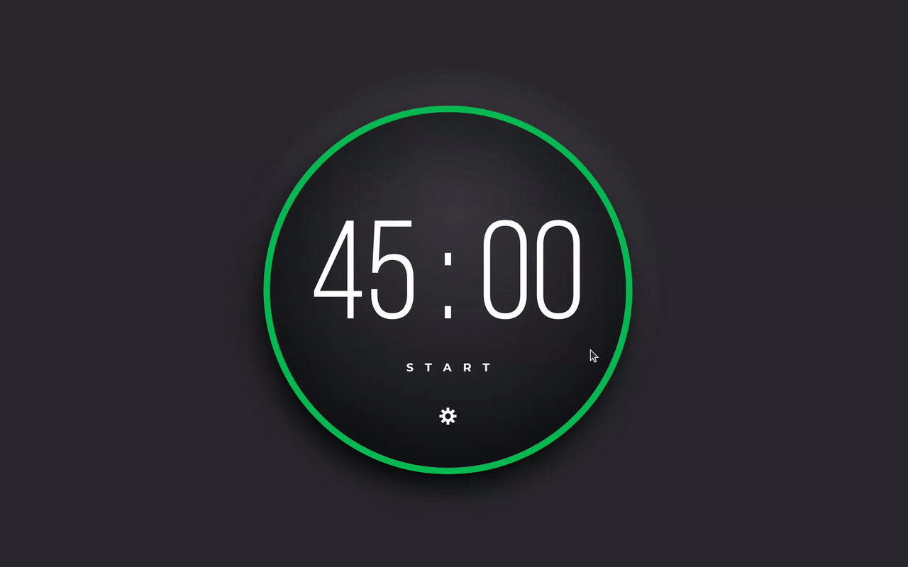

# Day 1 - Pomodoro Timer

## Overview

## Challenge

**Users should be able to:**

- Start the timer by clicking on the start link/button.
- Once the user clicks start, the word start will change to stop. Then, the user can click on the stop button to make the timer stop.
- Click on the gear icon to change the length (minutes and seconds) of the timer.
- Once the timer finishes, the ring should change from green to red and an alert message is passed to the browser.

## Write-up

### JavaScript Challenges

The timer logic was written by vanilla JavaScript API.
Only use Vite as development tool.

Used concepts:

- Classes
- Enclosure

Used API:

- querySelector
- addEventListener
- classList.toggle
- toggleAttribute

Used syntax sugar:

- Optional chaining
- Nullish coalescing

The implementation could be further improves such as write a stand alone _raf_ utility class.

### CSS Challenges

Used CSS skills:

- Variables and Calculation
- Grid layout
- Circle border and shadow
- Using SVG to draw a circle

It's not easy for me, I have to follow the solution to create the CSS.
