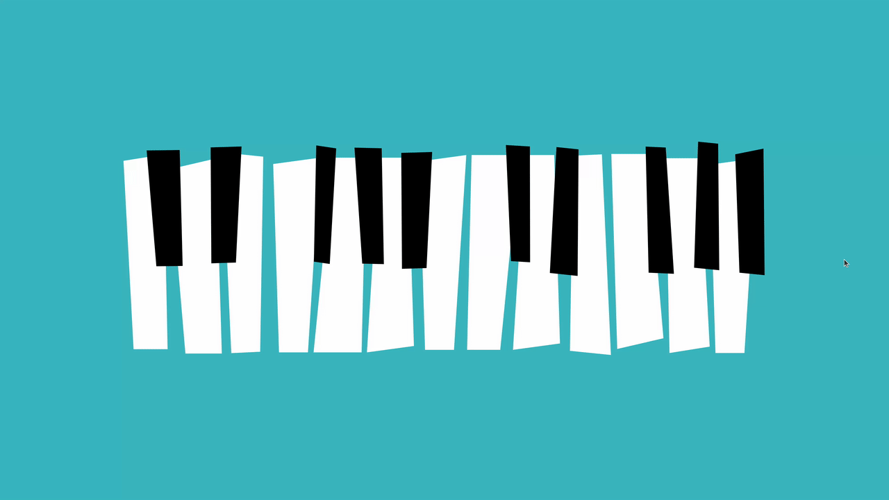

# Day 3 - Keyboard

## Challenge

**Users should be able to:**

- See the keyboard centered on the page
- Whenever a user hovers over a specific key it will change colors
  - White keys will change to yellow `#ffd200`
  - Black keys will change to pink `#f40082`
- When a user clicks on a specific key, it will play an audio clip.
  - The audio clips are numbered, but I did not specifically number the keys. You can pick which key should be associated with each audio file.
  - If a user clicks on one key, then immediately clicks on a second key. The 2 files should both play. Meaning, clicking on one key will not stop an existing audio file from playing.

## Write-up

### CSS

Remember that external svg images loaded from img tag will not get the styles from CSS.
Only in-line svg elements will get the styles.

### JavaScript

SVG element has its own events.
It won't work if we simply bind the click events on the keys.
There is one hack, wrap the path object in svg by a hyper link (<a>),
and than it will trigger the click event if we click on the keys.

I'm not sure why addind the hyper link elements by JavaScript won't work.
Therefore we have to manually add them.
I used vim and replace by regular expresions.

### Improvements

I added randomly assign audio files earch time loaded the page.

