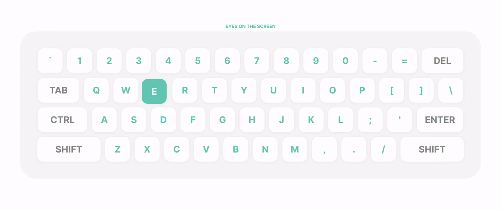

# Day 4 - Computer Keyboard

## Challenge

**Users should be able to:**

- See the computer keyboard centered on the page
- A random letter will start to jiggle.
- The user should type the same key that's jiggling and it will stop.
- A new, random key will start jiggling

## Write-up

### CSS

The flex layout works perfectly for this challenge.

### JavaScript

I used margin to draw the jiggle animation.
Remember to set both left and right with the same pair of values.
For example, if we want to shift left 12px, set margin left to -12px and margin right 12px.
Otherwist other elements will be shifted because of that offset.
Same for top and bottom margin.

I also use frame rate to control the animation, 15 fps is perfect for me.
