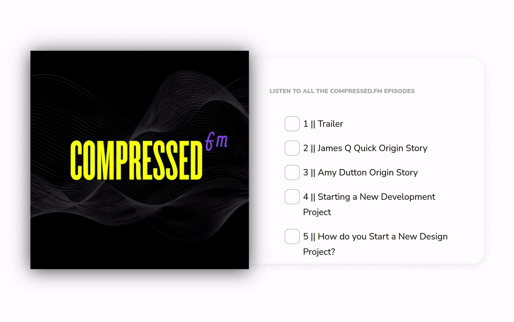

# Day 5 - Multiple Checkboxes

## Challenge

**Users should be able to:**

- See the list of podcast episodes
- Checking off an episode will mark the episode as watched and will strike-through the title
- See the list of podcast episodes
- Check one episode, shift-click to select all the episodes in between

### Content

1. Trailer
2. James Q Quick Origin Story
3. Amy Dutton Origin Story
4. Starting a New Development Project
5. How do you Start a New Design Project?
6. Freelancing (Part 1)

## Write-up

### CSS

The checkboxes were replaced by an images.
Just set a background image for the label element.
Use padding to shift the backage image to the left.
Switching the background images could be done by pure CSS.

I added additional scrollbar becuase if we follow the disign in Figma,
the font size is too large and there is not enough space to display full contents.
The contents in the challenges is different from the Figma design.

### JavaScript

We need to bind a global event to detect if user is holding the shift key.
Every time user clicked a checkbox, we need to save its index.
And then update the list of checkbox by the last index and the current index,
if user is holding the shift key.
Remember to exclude the last index because it will be clicked twice.

One tricky thing is that if we use `toggleAttribute` API, it wont update the CSS styles.
I have to use the `click` API to simulate user's clikc behaviours.
