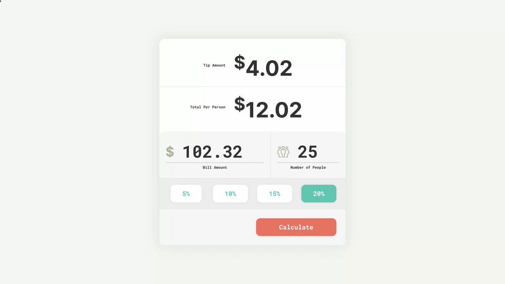

# Day 7 - Tip Calculator

## Challenge

**Users should be able to:**

-   Input a different bill amount and number of people.
-   Select a percentage to tip. Only one percentage can be selected at a time.
-   calculate the tip based on tip percentage, bill amount, and number of people.

## Write-up

### CSS

### JavaScript
