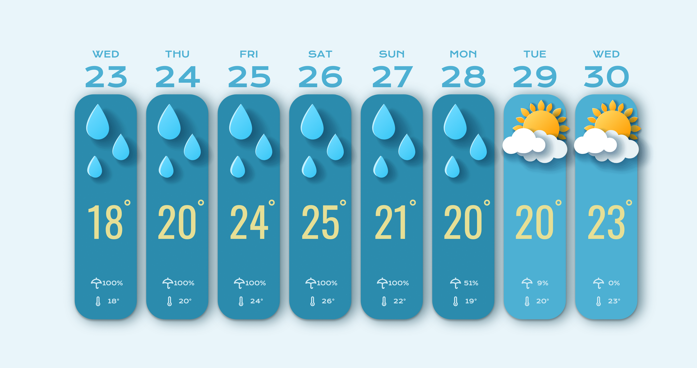

# Day 8 - Weather Forecast

## Challenge

**Users should be able to:**

-   Display the weather forecast.
-   View weather for the upcoming week.

## Write-up

### CSS

Again, to apply CSS on svg images, we needs the inline svg.
In order to avoid creating multiple SVG images via JS,
we can use the use element from SVG, to refer the existing SVG path.

Using img tag to display svg will not display the drop shadow correctly.
Another issue is if we put the svg in a hidden div, their colours will be affected.
Thus we should wrap all svg images within a symbol tag, 
and use the use element to refer them by id.
symbol element will not be display on the screen.

### JavaScript

The first time we need to use fetch API in this challenges.
