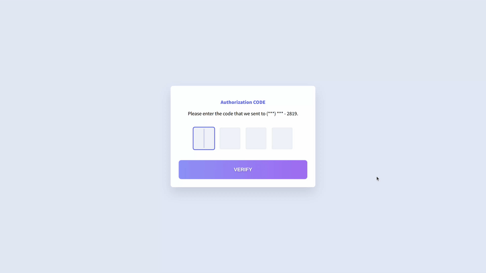

# Day 10 - Verification Code Form

## Challenge

**Users should be able to:**

-   Enter a 4 digit authorization code into the input fields.
-   Type in a digit and automatically be taken to the next input
-   Paste in a 4 digit code

## Write-up

### CSS

Simply copy all styles from Figma.
The Verification Code boxes were created by unorder list,
with 'contenteditable' attribute.
We can change their outline to set the colour when user focused on one of them.

### JavaScript

The most tricky point is how to handle the keyboard event.
Since the Ctrl-V shortcut will also trigger keydown and keyup events.
We have to save the original digit and restore it to prevent losing the first digit.

If user press a key, it will trigger keydown and then keyup events.
We clean the digit box in the keydown event.
And then update the digits in keyup event.
