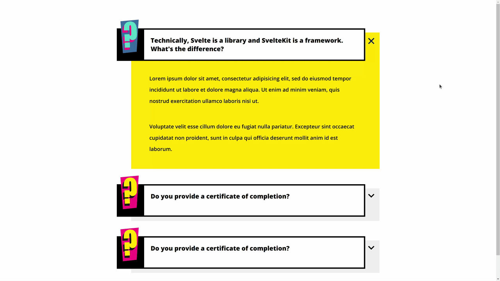

# Day 11 - Expanding and Collapsing Sections

## Challenge

**Users should be able to:**

-   Set a class to display the collapsed or expanded section.
-   Click on a collapsed question to expand it and view the answer.
-   Click on a collapsed answer to collapse it and hide the answer.

## Write-up

### CSS

Draw all element by fix dimension, copied from Figma.
And use absolute position to set offset to the floating images.
We have two sets of variable in different scope.
Under the expand scope, it will apply another set of varibales to change the interface.

### JavaScript
