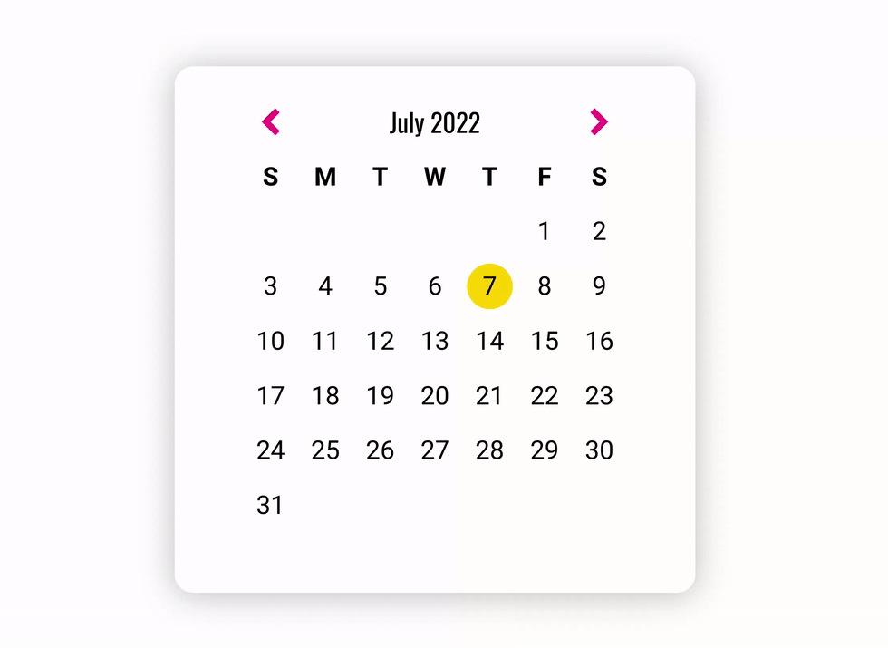

# Day 14 - Calendar Viewer

## Challenge

**Users should be able to:**

-   See the current month's calendar displayed
-   See the current month name
-   See today (December 14) highlighted
-   An arrow, pointing to the left to display the previous month
-   An arrow, pointing to the right to display the next month
-   View calendar with correct days with the current day highlighted
-   Navigate through different months

## Write-up

### CSS

-   Build the calendar by grid layout
-   Simply set the size and background to highlight today

### JavaScript

-   Using the native JavaScript Date object
-   Would could get the last day of the current month by setting month as next month and day as *zero*
-   The offset of the first day is the weekday of the first day in that month
