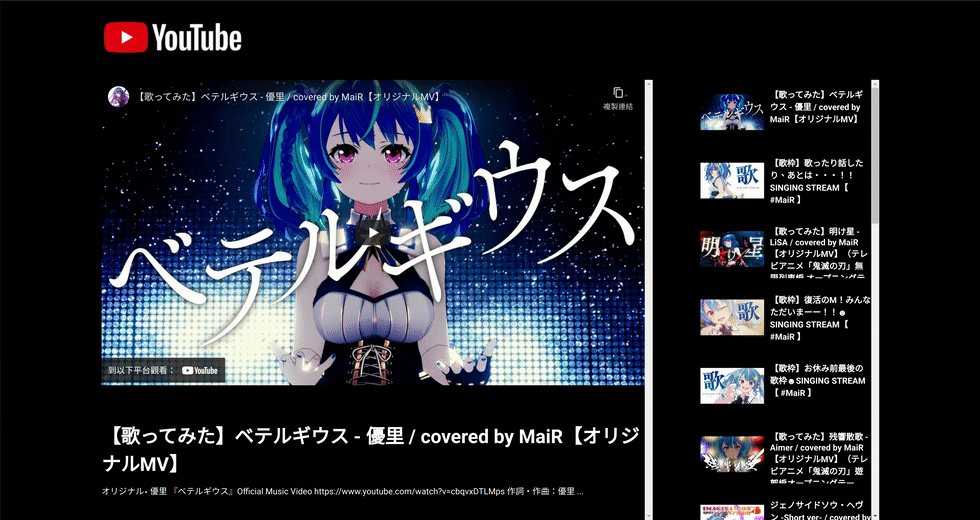

# Day 15 - YouTube Video Gallery



## Challenge

**Users should be able to:**

-   See a Featured Video as a video embed from YouTube, with its corresponding title and description
-   A sidebar with additional videos. These videos will show a thumbnail and corresponding title. Each thumbnail will link to that specific video on YouTube.
-   The featured video and the sidebar of video thumbnails should scroll independently of each other.
-   view title, description, and embed of featured video from the channel
-   view gallery of title and thumbnails for other videos

### Sample Data

Downloaded from YouTube APIs Explorer with the following: 

```
curl \
  'https://youtube.googleapis.com/youtube/v3/search?part=snippet%2Cid&channelId=UCsiKFVHkQSMlSe0vaCG0anw&maxResults=20&order=date&key=[YOUR_API_KEY]' \
  --header 'Authorization: Bearer [YOUR_ACCESS_TOKEN]' \
  --header 'Accept: application/json' \
  --compressed

HTTP/1.1 200 
cache-control: private
content-encoding: gzip
content-length: 4092
content-type: application/json; charset=UTF-8
date: Tue, 05 Apr 2022 18:02:57 GMT
server: scaffolding on HTTPServer2
vary: Origin, X-Origin, Referer

```

## Write-up

### CSS

-   Place the first level elements in a grid
-   Calculate the content height by 100vh - header size
-   Set over-flow to show or hide the scroll bar and content
-   Crop the featured image using css *object-fit* and *object-position*

### JavaScript

-   Fetch data form YouTube API and parse the data
-   Replace the featured video if user clicks one of the list items

