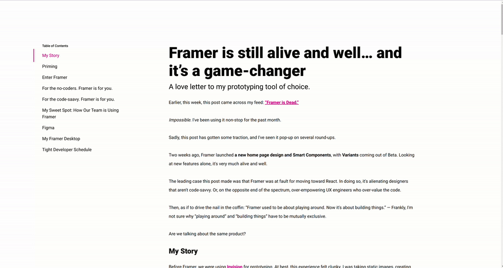

# Day 17 - Table of Contents

## Challenge

**Users should be able to:**

-   See a blog post layout, formatted with a sidebar and content area
-   View the currently visible header in the table of contens

## Write-up

### CSS

-   The aside sidebar uses sticky position
-   The sidebar and main contents are using grid system wiht 12 columns

### JavaScript

-   Register the scroll event to trace the header moving
-   Uses `getBoundingClientRect()` API to get the header's position on screen
-   Uses `window.innderHeight` to get the screen size
