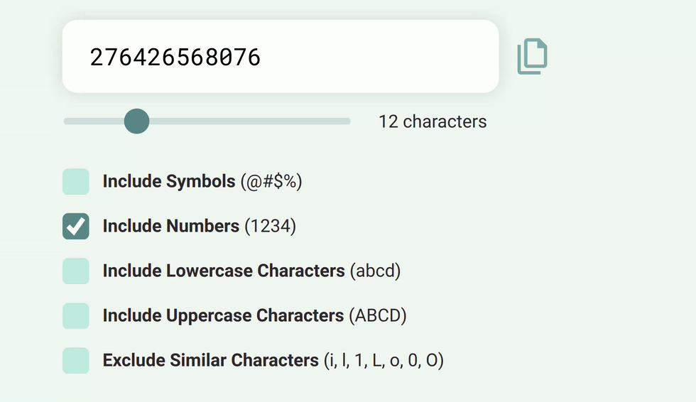

# Day 18 - Password Generator

## Challenge

**Users should be able to:**

-   See a form input for displaying a generated password
-   A copy button should appear to the right of the input field. When the user clicks on the copy button, the word “Copied” should appear. _NOTE: Showing and hiding the “copied” text can only be achieved within JavaScript. However, we will be creating all of the elements needed to be able to do this within JavaScript_
-   Range slider for selecting the number of characters. The number of characters should be displayed next to the slider.
-   Checkboxes for the following
    -   Include Symbols (@#$%)
    -   Include Numbers (1234)
    -   Include Lowercase Characters (abcd)
    -   Include Uppercase Characters (ABCD)
    -   Exclude Similar Characters (i, l, 1, L, o, O, 0)
-   The text input field should automatically update as the range field changes or one of the items is checked
-   The user can click on the copy icon to the right of the input field to copy the password to their clipboard.
-   When a user clicks on the copy icon, a class of "copied" should be added to the button. This will display the word "Copied" and change the text color to green.
-   After 5 seconds, the "copied" class should be removed from the button.
-   The range slider should allow the user to change the password length. The minimum amount is 6 and the max is 32 (limits are imposed through the HTML element)
-   Checking symbols will allow symbols to be used in the password
-   Checking numbers will allow numbers to be used in the password
-   Checking lowercase letters will allow lowercase letters to be used in the password
-   Checking uppercase letters will allow uppercase letters to be used in the password
-   Checking exclude similar letters will remove similar letters from the password (i, l, 1, L, o, 0, O)

## Write-up

### CSS

-   Challenge 5 + 6 + 16

### JavaScript

-   Creating the pool from options and randomly then seslecting characters from the pool, to generate a new password
