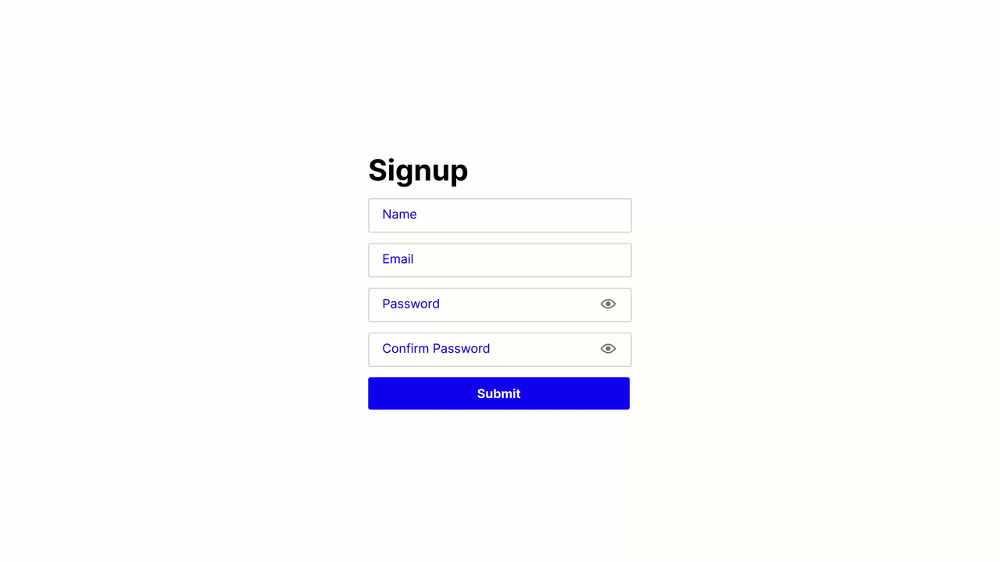

# Day 19 - Signup Form with Validation

## Challenge

**Users should be able to:**

-   Users should be able to enter
    -   a name (text)
    -   an email address (email address)
    -   a password (password)
    -   confirm their password (password)
-   When the user focuses on the text field, the label should move (within CSS)
-   Display a toggle button for showing and hiding the password
-   Display an error message to the right of the input field.
-   Display a success check to the right of the input field.
-   When the user unfocuses a field, the form should perform a validation check
-   All the fields are required
-   Should enter a properly formatted email address
-   The password and confirm password fields should match
-   Clicking on the show / hide button on the password field should change the visibility of the password (simply change the input `type` from `password` to `text` or vice versa)

## Write-up

### CSS

-   Use Placeholder-shown pseudo element to change the input label style
-   Use CSS transition to implement the label moving animation
-   The errors and success icons position were absolute, related to the input box parent field

### JavaScript

-   Created validation classes for each input field
-   Focusout input event to trigger the validation function

