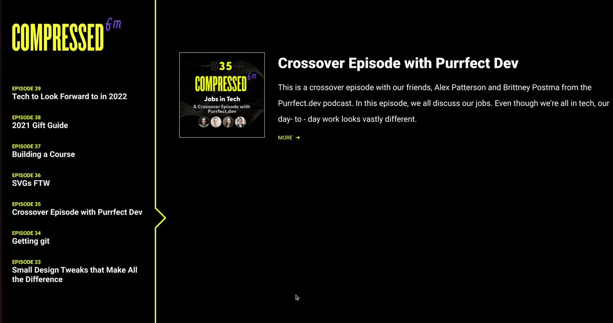

# Day 20 - Tabbed Content

## Challenge

**Users should be able to:**

-   See a list of 7 Compressed.fm episodes in the sidebar
    -   For each episode, you should see the episode number and title
-   Click on an episode in the sidebar and see its contents in the right content area
-   In the content area, you should see the following information for each episode
    -   Cover Image
    -   Title
    -   Description
    -   Link to see more

## Write-up

### CSS

-   Create the layout with aside and main element
-   Also using flex box layout
-   Create the arrow using CSS border
    -   We draw the arrow using before and after pseudo elements
    -   Set their dimension and font size both to 0px
    -   Draw the left border in solid colour, the orthers in transparent
    -   Result should be a triangle pointing to the right
    -   We shift the after pseudo elemnet a little bit and set it in background colour
    -   Finally we can see a line
    -   The shifting offset I used was 1.5 times to the line width, i.e. 6px = 1.5 x 4px

### JavaScript

-   Build the episode list dynamically
-   Update the right hand side contents on click
-   Update the selected episode

