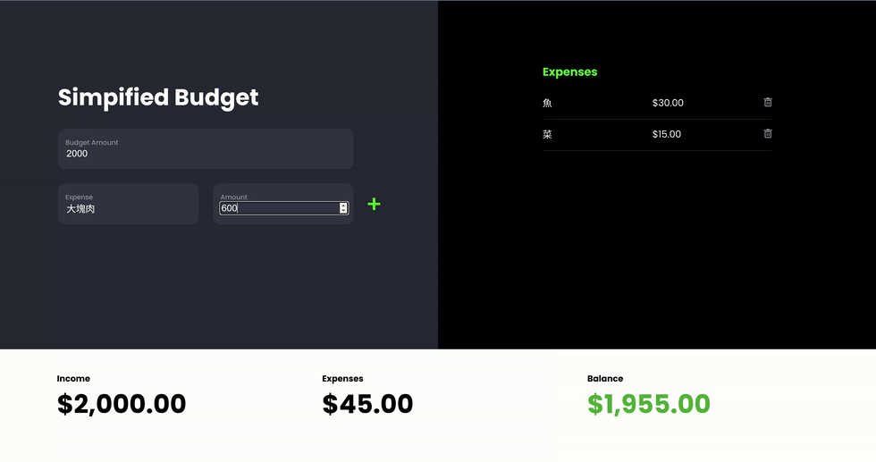

# Day 21 - Simplified Budget

## Challenge

**Users should be able to:**

-   The user should be able to enter a budget amount. As soon as they leave the budget amount input field (blur), the summary information should update
-   The user should be able to ender a vendor and an amount into the input fields. When they click on the plus button, the amount should get added to the table on the expenses table on the right.
-   When an expense is added, the summary information should be updated
-   The user should be able to click on the delete an expense button and the row will be removed
-   When an expense is removed, the summary information should be updated
-   The summary information in the footer should display the income, expenses, and balance
-   If the balance is a positive number, the text should be green.
-   If the balance is a negative number, the text should be red.

## Write-up

### CSS

-

### JavaScript

-

