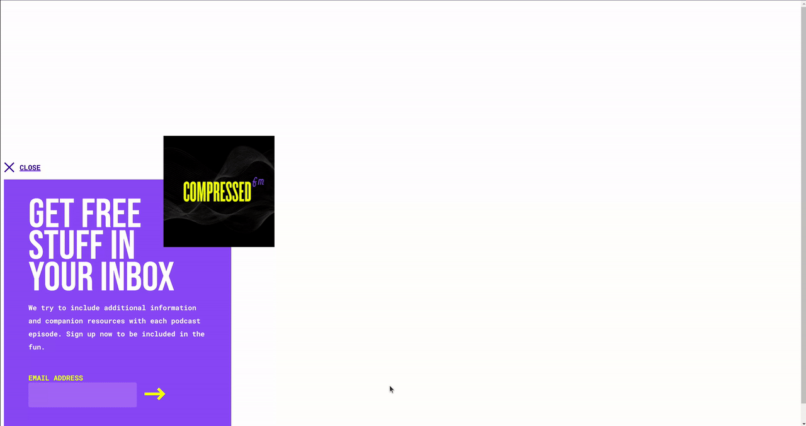

# Day 23 - Toaster

## Challenge

**Users should be able to:**

-   See a toaster pop-up in the bottom left corner of the screen
-   There should be a title, paragraph of text, and form for signing up for the newsletter.
-   There should be a close button at the top
-   The Compressed.fm album artwork should be on the edge of the toaster pop-up
-   When the page first loads, the toaster should be hidden. (Add a class of `collapsed` to the `
` on line 15.)
-   If the user moves their mouse toward the top of the page (exit intent) display the pop-up. (Remove the `collapsed` class on line 15.)
-   If the user has been on the site for more than 15 seconds, display the pop-up.
-   Clicking on the close button, makes the toaster disappear.

## Write-up

### CSS

-   Put the toaster in fixed position
-   Add pseudo element which is float to the right of the title, to preserve the area for the cover image

### JavaScript

-   Browsing detection
    -   Bind the _mousemove_, _scroll_, and _keydown_ events to update the sitting timestamp
    -   Create a requestAnimationFrame function to check the sitting timestamp
    -   Display the toaster if the timestamp differences is longer than the cooldown time
-   Mouseleave event
    -   Bind the _mouseleave_ event to display the toaster when user's mouse leave the document area
