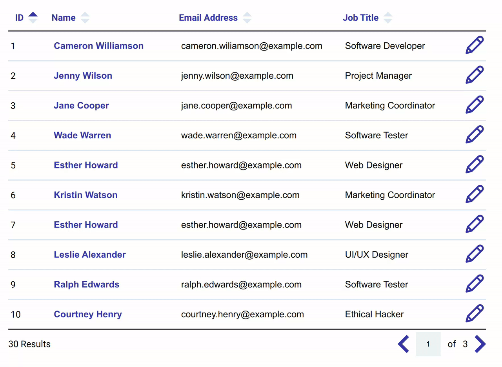

# Day 24 - Dynamic Table with Pagination

## Challenge

**Users should be able to:**

-   Display 10 entries of data preloaded into **app.js**
-   Sort columns ascending or descending by ID, Name, Email Address, and Job Title
-   Click on the edit button and the row will show the content in an inline form. Changes can be confirmed by clicking on the check button.
-   The user can jump to a specific page by changing the number in the pagination text field (bottom right). Data is updated as soon as the user clicks off the input (blur).
-   The total number of results is displayed (bottom left).
-   When sorting ascending the top arrow in the table header will be a darker blue and the bottom arrow will be a lighter blue. You can update the style by adding a class of `ascending` to the `button`. See line 22 in the index.html starter file as an example.
-   When sorting descending the bottom arrow in the table header will be a dark blue and the top arrow will be a lighter blue. You can update the style by adding a class of `descending` to the `button`.
-   Users can view the next page of data (if you’re not on the last page already) by clicking on the next arrow (bottom right).
-   Users can view the previous page of data (if you’re not on the first page) by clicking on the previous arrow (bottom right).

## Write-up

### CSS

-   Set `cellpadding` and `cellspacing` to zero within the table element, to remove the default cells styles
-   Table footer use column span to place the pagination controller
-   Use CSS to fill colours for the sorting buttons
    -   They must be in-line SVG elements
-   Using symbol to reference the editor buttons
    -   Use CSS to hide or show the editor images

### JavaScript

-   The entire table logic was composited by four parts
    -   Table controller provide the interface for communication
    -   Table base render the cells and handling pagination
    -   Data set take care of sorting algorithm
    -   Editor will toggle the editor UI
